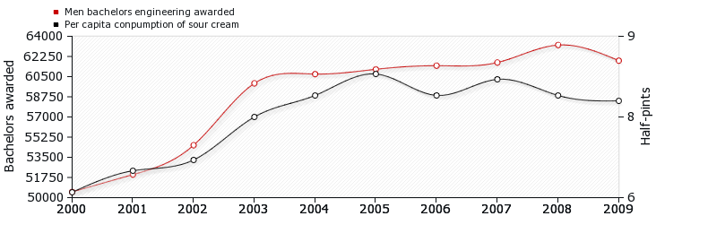

## Approaches to research

Doing research is an integral part of your training as a psychologist.

But before you can start thinking about **doing research** you need to be aware
of the different **approaches** that are available to you.

In today's lecture, we'll cover approaches from the two traditional divisions:

- _qualitative_ methods and

- _quantitative_ methods

And we'll finish off by talking about how _computer simulation_ can be used in
**psychology research**.

---

## Qualitative and Quantitative methods

We can split approaches to research into two **broad categories**

We can give some _simple_ descriptions of these categories. 

1. **Quantitative** methods collect numbers/numerical data and use statistical
   tools 

2. **Qualitative** methods collect words, pictures, and artefacts

Some researchers also adopt both approaches (*mixed-methods*) or apply
*quantitative methods* to *qualitative style* data.

**Quantitative methods** are probably easier to group together, because many
different approaches can be grouped under **qualitative methods**.


This course **focuses** on **quantitative methods** but you'll learn more about
**qualitative methods** in later years.

---

### Outline of quantitative methods

Quantitative approaches take a phenomenon and try to **condense** it down into
a few dimensions or **variables** that can be **measured** as _precisely and
reliably_ as possible.

It is very important to choose **variables** that are **representative** of the
phenomenon you're studying.

Choosing variables that are representative of the phenomenon you're interested
in involves **operationalisation**.

- **Operationalisation** means choosing a **measurable** proxy for the
  phenomenon you're interested in^[*Operationalisation* will be an important part of your
lab report] 

---

### Outline of quantitative methods

Quantitative approaches often make use of **statistical methods**

- Using **statistical methods** means looking at lots of cases (for example,
  studying lots of people, not just one or two).

The goal with quantitative methods is often to develop **generalisations**, or
theories that are **generally applicable**.
	
- Involves testing **predictions** that logically follow from **theories**
  (the _deductive_ step)^[Refer back Lecture 2 if you're unsure what
  *deductive* means] 

---

### Outline of qualitative methods 


**Qualitative methods** are focused on **meaning** rather than **measurement**.

Instead of **condensing** a phenomenon down **to a simple set of features** or
dimensions, **qualitative research** tries to examine **many features.**

Qualitative approaches try to look at **all aspects** of one or a few
**instances** of a phenomenon.

**Qualitative approaches** view the **context** (*physical environment*,
*social setting*, *cultural context*) as a **central** part of the phenomenon
being studied.


Qualitative approaches—e.g., **grounded theory** and **phenomenology**—also
emphasise the idea of following the data wherever it leads (that is, the
_inductive_ step).  

---

## Qualitative methods 

Qualitative methods are extremely varie with many different methodologies,
underlying theoretical assumptions, and intellectual histories

I can't do them all justice in one short lecture, so we'll only cover a few:

- Verbal protocol analysis
- Ethnographic methods
- Discourse analysis 
- Phenomenology 

However, there are many more, including Case Studies, Grounded Theory,
Participatory Research, Focus Groups, and many more. 


I'll try to draw out some of the contrasts between **qualitative** and
**quantitative** methods more generally and highlight **strengths** and
**weaknesses** of each approach.

---

### Verbal protocol analysis

Also known as **"_thinking aloud protocols_"**  (or **"_talking aloud
protocols_"**)

- Involves collecting and analysing verbal data on cognitive processing

- Participants are given a task (usually a task that involves multiple steps
  that are chained together) and are asked to verbalise (speak aloud) what they
  are thinking as they go about solving the task

- Data (i.e., recordings of what the participant said) are coded an analysed to
  infer the information processing steps involved in solving the problem 

The approach was used in early *Cognitive Science* by *Simon* and *Newell* who
were pioneering researchers in *Cognitive Science* and *Artificial
Intelligence* (Computational Theory of Mind)

Carries **certain assumptions** about the nature of human cognition/thinking,
e.g., that it involves *information processing in discrete sequential steps*.

---


```{r}
#| tbl-cap: Example Verbal Protocol Analysis
#| tbl-label: tbl-vpa
readr::read_csv(here::here("data","./vpa_example.csv")) |>
  knitr::kable()
```


---


### Ethnography 

More a **style of research** than a **method of data collection**, ethnography
involves studying people in "the field" (i.e., their naturally occurring
setting), and requires the researcher to **enter into the setting they are
studying** 


- Attempts to understand how the socio-cultural practices and behaviours of
  people are shaped by their social, physical, and cultural contexts

- Tries to make sense of events from the perspective of their participants

- Could include data from *interviews*, or *participant observation*^[In
  *auto-ethnography*, researchers engage in self-reflection and treat
  themselves as the participant.]

---

### Ethnography 

In **cognitive psychology**, ethnographic approaches have been used to
understand how people solve problems in **real-world settings**. 

For example, how do **technological artefacts** (that is, the *context*)
to support cognitive processing^[One famous study in cognitive ethnography
involves studying how sailors use the technological artefacts (instruments
etc) and layout of a ship to help them navigate]

In **critical psychology**, ethnographic approaches have been used to
understand the interplay between, **race**, **class**, **gender**, and
**education** in shaping participants' **life worlds**. 


---

### Discourse analysis

Discourse analysis is the _social_ study of language as used in **talk**,
**text**, and **other forms of communication**.

It involves a distinctive way of thinking about talk and text where language
doesn't just **represent** the world but also **constructs** the world.

Some of the questions one might examine with this approach:

- How does language shape social relations? For example, how might certain
  kinds of talk establish professional distance in doctor-patient communication 

- How might language construct or open up space for particular identities. For
  example, how might language enforce or break down the concept of binary
  gender 

---

### Discourse analysis

The strengths of this approach are that it allows you to examine **how language
constructs reality.** 

It can make use of primary data (interviews, talk in focus groups) or secondary
data (books, newspaper articles).

But it can be difficult to use discourse analysis to develop the same kind of
**generalisations** as you might develop with other approaches. 


---

### Phenomenology

Particularly associated with the philosophers _Husserl_, _Merleau-Ponty_, and
_Sartre_

The phenomenological approach involves **bracketing off** any preconceived
notions we might have about a phenomenon to achieve an understanding of that
phenomenon that has not been influenced by our prior beliefs.

Phenomenology emphasises peoples first-hand experience and attempts to
**understand** and **describe** subjective experience from the participant's
point of view. 


---

### Phenomenology

Phenomenology has been used in fields like **cognitive psychology** to
understand, for example, the nature of subjective sensory experiences, the
nature of skilled actions, and the nature of cognition itself (e.g., been used
to argue against the computational theory of mind).

A **phenomenological** approach to studying, for example, inclusive classroom
settings might try to understand **what it is like** for a student with a
disability to be in that classroom setting.

An **ethnographic** approach might look at how the classroom setting **changes
interactions** between students with and without disabilities. 

---

## Issues in qualitative research 

Unlike **quantitative methods** than might use **printed questionnaires** or
**computers** to record and measure responses, in **qualitative research**, the
**researcher is the instrument**

- important for researchers to reflect on their **values**, **assumptions**,
  **biases**, and **beliefs** to understand how these might impact the research

- the research instrument (i.e., the researcher) can change. For example, in
  _ethnographic research_, the changes in the _researchers experience_ might
  alter how they record and observe behaviours. 

There are parallels to **validity** (*internal* and *external*),
**reliability**, and **"objectivity"** in in **qualitative 
research**^[We'll touch on these topics today, but you'll also learn more about
these concepts in coming lectures]

These are **Credibility**, **Transferability**, **Dependability**, and **Confirmability**

---

## Issues in qualitative research 

- **Credibility**: Can the data support the claims. Can be established through
  _prolonged engagement_, discussions with other researchers/participants, and
  critical self-reflection

- **Transferability**: Can the findings be transferred to similar **contexts**.
  Requires extensive, detailed, and careful descriptions of the research
  **context** (**"thick descriptions"**).

- **Dependability**: Ensuring that researchers maintain a record of changes in
  the research process or research instrument (i.e., themselves) over time. 

- **Confirmability**: Concerned with ensuring that the data used to support the
  conclusions are _verifiable_. 

---

## Quantitative methods

As the name suggests, a key aspect of **quantitative methods** is
**quantification**.

**Quantification** means putting numbers to the thing we're interested in studying so that it can be **measured**.

The motivation behind **measuring** phenomena is that measurements are
**publicly available and verifiable** (e.g., scientists can **check** or
**verify** your measurements).

Unlike *qualitative research* where researchers try to simultaneously study
many aspects of a single phenomenon, **quantitative research** tries to condense
a phenomenon down into a single (or a few) dimension(s).

The first step in quantitative research is often figuring out how **to
quantify** the phenomenon of interest. This involves choosing a **proxy**
(something measurable) that can **stand-in for** the phenomenon

---

### Operationalisation

If you're interested in **anxiety**, you have to decide how to **measure**
anxiety. You can't measure an **abstract concept** directly.

The process of choosing a **proxy** is known as **operationalisation**.

There are lots of ways to choose a **measurable** proxy that can stand in for **anxiety**. 

1. Develop a **scale** or a **questionnaire**.    

2. Measure **physiological responses** like _increased heart rate_ or _galvanic skin response_. 


---

### Operationalisation

Measurements have to be **reliable** (reproducible) and **valid** (actually
measure what you think you're measuring). 

For example, if we develop a scale for **depression** then the scale must
produce similar numbers when applied to the same person or to different
people who are similarly depressed.

A treatment for depression, should not just **reduce scores** on our
depression scale, but it must also **result in people experiencing less
depression**. 


---

## Quantitative methods and causation 

Unlike **qualitative** research, which studies phenomena *in the wild*,
**quantitative** approaches try to exert a lot of **control** over phenomena.

**Control** allows researchers to make claims about **causation** and give
**causal explanations**.


There are a few ways to understand **causation**, and thinking about what
**causation** means will help us to think through ways to examine, study,
or identify it:

---

### What is a cause?

One view of **causation** can be summed up _as a **difference** that makes a
**difference**_:

- If you take two situations, one in which the phenomenon occurs and another in
  which does not occur then whatever is different between those situations is
  the **cause** of the phenomenon.

<small>For example, take one situation in which a _window is broken_ and
another in which a _window isn't broken_. If the only difference between the
two is that in one _a boy has thrown a rock_ and in the other _a boy has not
thrown a rock_ then **a boy throwing a rock** is the **cause** of the **broken
window.**</small>

---

### What is a cause?

You can also understand causation _in terms of **manipulation**_: 

- If you can manipulate one thing and observe a change in another, then the two
  things are may be **causally connected**.

<small>For example, as I *put my foot down or lift it from the accelerator
pedal in a car* I can observe *a change in the speed of the car*, so I know the
**accelerator pedal** and the **speed of the car** are **causally connected**.
By intervening and manipulating parts of **a system** you can identify how they
work (you can identify **mechanisms**).</small>


---

### What is a cause?

Causation can also be understood _in terms of **probability**_: 

- If the presence of one thing increases the probability of the other thing
  occurring, then there **may** be a **causal relationship**. 

<small>For example, the presence of _smoking_ increases the probability of
_developing cancer_, so _smoking_ **may** be the **cause** of _cancer_.
</small>

---

## Causation and confounds 

In the examples above they are all examples of **possible** _causes_

To be justified in claiming a causal relationship **other conditions must
usually be met**.

And causal claims are not always .red[black] and .green[white]. Sometimes we
can only be more or less sure about causal relationships.


<br />
<br />

.center[.blue[What are some of the other conditions that need to be met?]]

---

### An example of Smoking and Cancer

- The presence of _smoking_ increases the probability of _developing cancer_,
  so _smoking_ **may** be the **cause** of _cancer_.

- *Having emphysema* also increases the probability of *developing cancer*. But
  is *emphysema* the **cause** of *cancer*?

There is a **plausible mechanism of action between** *smoking* and *cancer* but
not between *emphysema* and *cancer*, so we can be more sure that *smoking*
**causes** *cancer* than we can be about *emphysema* **causing** *cancer*. 

<br />

A more likely explanation is that *emphysema* and *cancer* have a **common
cause**—*smoking*.

---

### Smoking and confounds 

Let's say you are studying the relationship between *emphysema* and *cancer*,
because you think *emphysema* might cause *cancer*

In this situation, *smoking* is a **confound**

If you wanted to see whether *emphysema** caused *cancer* then you'd have to
**control for smoking**

<small>
- Only look at smokers and see if there's still a relationship between
  emphysema and cancer or whether cancer also occurs in the absence of
  emphysema

- Only look at non-smokers and see whether emphysema and cancer are still
  related or whether cancer develops in the absence of emphysema
</small>

Emphysema and cancer are **correlated** (the increase in one leads to an
increase in the other), but emphysema doesn't cause cancer because they have a
common cause.

---

### Correlation and causation

- Sometimes two correlated variables have a causal relationship: smoking and cancer

- Sometimes they have a common cause: emphysema and cancer 

And sometimes they have neither:
- From 2000 to 2009, there was a strong relationship between the number of men
  getting engineering degrees and per capita consumption of sour cream.



---

## Qualitative vs Quantitative methods

In qualitative research, you study phenomena **in context** while in quantitative research you aim for **control**. 

But you can use either approach to study the same phenomena/psychological processes. 

<br />

.center[.blue[Let's say you're interested in **memory**:]]

<br />
<br />


.center[.blue[How could you study **memory** from a qualitative and a
quantitative perspective?]]

---

## Qualitative vs Quantitative methods

.center[**Quantitative:**]

You could use experiments in a lab where you give people lists of words to
remember. You could *manipulate* aspects of the words— for example, their
**emotional salience**—and measure performance (accuracy scores) to try and
understand something about **memory** and **emotional salience**.

<br />

Ensure that the only thing that differs between the words on each list is the
**emotional salience**. Control for possible **confounds** like:

- **word length**: make sure that one list doesn't contain long words and the
  other short words)

- **order**: make sure some people get the lists in one order and some in the
  other order, because maybe people get tired by the end and that influences
  memory.

---

## Qualitative vs Quantitative methods


.center[**Qualitative:**] 

For a **qualitative** approach you don't want to study memory in the lab—you want to study it in the wild. This allows you to **ask different kinds of questions**.

You could use an *ethnographic* approach with, for example, bartenders. You
might do fieldwork in a bar **observing** bartenders. Through this, you might
see that bartenders **structure their environment** in a particular way—e.g.,
put certain types of glasses or bottles in particular places. 

<small>
- This might lead you to form the hypothesis that bartenders **structure their
  environment** to support their memory—i.e., placing certain bottles and
  glasses together helps them remember what goes in what kinds of cocktails. 

- Follow-up interviews or discussions with bartenders or observing the training
  of bartenders might provide further evidence for this hypothesis. 

- You might also engage in bartending and critically reflect on your own
  experience to understand how this **environmental structuring** supports
  memory. 
</small>

---

## Computer simulation and formal methods

**Qualitative** and **quantitative** methods try and understand phenomena by
studying the phenomena themselves. The **data** they use comes from the
phenomena.

In approaches like **computer simulation** and **formal/mathematical
modelling** researchers instead **generate the data**.

Researchers try to **build systems** that _replicate_ or _reproduce_ some
aspects of systems or phenomena they are studying. 

- This might allow them to **gain new insights** into these systems.

- **Comparing** the behaviour of their **artificial systems** with the
  **natural system** allows researchers to test theories about the
  **processes** that produce phenomena

---

### Computer simulation 

**Computer simulation** has been used to study a lot of different phenomena in
psychology, but here are some examples of approaches I find particularly
interesting.

**Simulation** has been used to show how **seemingly complex behaviour** can
arise from **very simple processes**. 

.pull-left[]

.pull-right[Flocking behaviour in birds seems very complex, and it looks **as
if** there must be something very complex going on inside their brains. 

But you can **simulate** this behaviour with only three simple rules:

<small>
1. **avoid** collisions with other birds
2.  **align** direction with nearby birds
3.  **approach** distant birds]
</small>

---

#### Example simulation of flocking birds<sup>1</sup> 

<script src="./mouse.js"></script>
<script src="./boids_sim.js"></script>
.center[<canvas id="viewport" width=400 height=400 style="border:1px solid black;"></canvas>]  
.center[<button onClick="init();">Run/reset simulation</button>]

.footnote[<sup>1</sup>Adapted from http://www.harmendeweerd.nl/boids/]

---

#### Conway's game of life<sup>1</sup>

<iframe width="500px" height="500px" style="border:none; margin-left:auto;
margin-right:auto;display:flex" src="game_of_life.html"></iframe>


.footnote[<sup>1</sup> Read more about [Conway' Game of
Life](http://www.scholarpedia.org/article/Game_of_Life)]

???

Conway's Game Of Life is made up of four simple rules:
Any live cell with fewer than two live neighbours dies, as if by underpopulation.
Any live cell with two or three live neighbours lives on to the next generation.
Any live cell with more than three live neighbours dies, as if by overpopulation.
Any dead cell with exactly three live neighbours becomes a live cell, as if by reproduction.

---

### Agent-based modelling (ABM)

Agent-based modelling takes a cue from approaches like those used to model bird flocking and Conway's Game of Life. 

In an agent-based model, the research simulates a group of 'agents'. 

- The 'agents' will typically have some memory, a set of goals, and some rules. 

- The memory allows them to store their current state or consequences of their previous actions. 
  
- The goals usually represent some state they're trying to achieve.  

- And rules govern their interactions. 

By allowing these agents to interact, and by manipulating aspects of the agents
(their memory, goals, and rules) is it possible to see how social phenomena can
arise. 

---

### Agent-based modelling (ABM)

For example, if you're interested in how **misinformation** is spread through a
social group, you could use an agent-based modelling approach. 

- If you thought that **misinformation** was more likely to spread if passed
  on by particularly influential individuals (e.g., celebrities or
  politicians), then you could include these in your simulation. 

- Or if you thought that misinformation was more likely to spread inside
  socially isolated groups, then you could modify your simulation to create
  socially isolated groups to test this hypothesis. 

You could still go and check the real world to see if it behaves like your
simulation.

